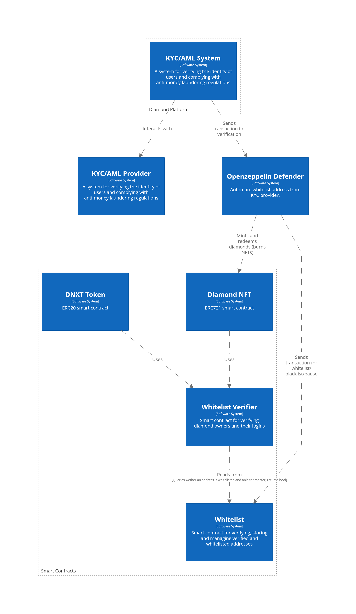

# Security and Compliance

The `Whitelist`, `WhitelistVerifier`, and `Pausable` smart contracts can contribute to making DNXT and Diamond NFT compliant with Article 30 of the Data Act, as follows:

(a) **Robustness and access control**: The `Whitelist` contract utilizes the `AccessControl` contract from OpenZeppelin, which offers rigorous access control mechanisms. It ensures that only specific roles, such as the `WHITELISTER_ROLE` and `DEFAULT_ADMIN_ROLE`, have the ability to modify the whitelist or manage other whitelister roles. Furthermore, the `WhitelistVerifier` contract checks if an address is whitelisted before allowing certain operations, ensuring a high degree of robustness against functional errors and manipulation by unauthorized parties.

(b) **Safe termination and interruption**: By including the `Pausable` contract from OpenZeppelin, DNXT and Diamond NFT smart contracts can have functionality for safe termination and interruption. The `Pausable` contract allows an admin to pause the contract in case of any issues or emergencies. This pause functionality can be applied to critical functions within the DNXT and Diamond NFT contracts to ensure safe termination and interruption. The conditions under which the contracts can be paused should be transparently defined, and only authorized parties with appropriate roles should have the ability to pause or unpause the contracts.

(ba) **Equivalence**: By utilizing well-established smart contract libraries like OpenZeppelin's `AccessControl`, `Whitelist`, `WhitelistVerifier`, and `Pausable` contracts, DNXT and Diamond NFT can be designed to offer a level of protection and legal certainty equivalent to traditional contracts. These libraries have been widely used, tested, and audited by the community, ensuring a high level of reliability and security.

(bb) **Protection of confidentiality of trade secrets**: The `Whitelist` and `WhitelistVerifier` contracts can be integrated with a third-party KYC/AML provider to help protect the confidentiality of trade secrets. In this setup, the KYC/AML provider would handle the sensitive user information, ensuring that it is securely stored and processed according to the current encryption and data handling standards.

The KYC/AML provider would only reveal the user's blockchain address to the smart contracts, which would then be used for whitelisting purposes. This approach allows DNXT and Diamond NFT smart contracts to maintain a secure and compliant system without directly handling sensitive user data.

By delegating the responsibility of managing confidential information to a trusted third-party provider, DNXT and Diamond NFT can better ensure the protection of trade secrets, in accordance with the given regulation. This way, the system can maintain a high level of security and compliance without sacrificing user privacy or exposing sensitive data to unauthorized parties.

<figure><figcaption></figcaption></figure>
